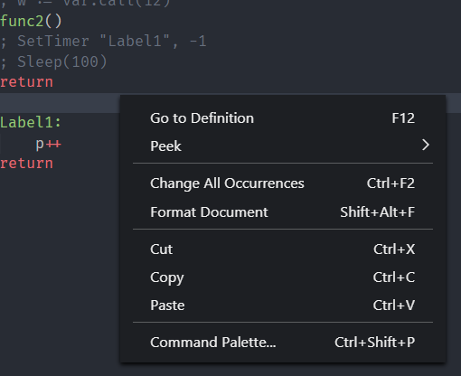
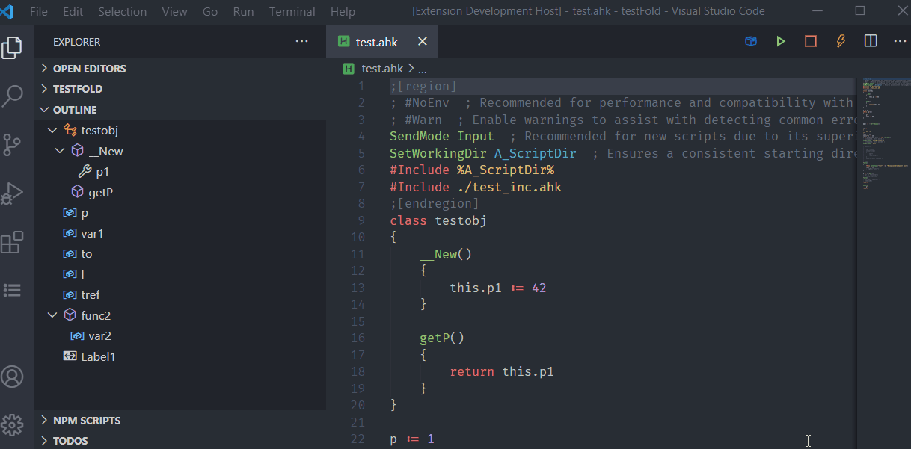

# Visual Studio Code Autohotkey Simple Support

A personal edition modified from [vscode-autohotkey](https://github.com/vinnyjames/vscode-autohotkey)  
And Microsoft lsp-simple

AutoHotKey language support for VS Code

## What's New

1. Enumerate include
   * Documents must be explicitly included by `#include`
   * **Notice** `#include DirName` and `#include <LibName>` are not implemented now
2. Folding region comment (comments marked region able to be folded, see in preview and feature)
3. Document formation, supports both v1 and v2 
4. Build-in Variable and Function(partly) hint.
   - Need documentions which is easy to be parsed by js/ts. If you find any, help please.

## Notice

* This is a parser based on regular expression. The results are not guaranteed.
* If you need a debugger, just install any debug extension in market. As recommended options, [AutoHotKey Debug](https://marketplace.visualstudio.com/items?itemName=helsmy.autohotkey-debug) by me or [vscode-autohotkey-debug](https://marketplace.visualstudio.com/items?itemName=zero-plusplus.vscode-autohotkey-debug) by zero-plusplus

## Feature
* Color Syntax(1.1.32 version)
* Comment blocks
* Snippets
* Code Completion
* Document symbol(class, method, variable, label, hotkey) 
* Goto Definition
* Signature Helper (tooltip for method parameters)
* Enumerate include documents
  * The documents must be explicitly included by `#include`
* Folding region commnet
  * mark region start by `;[region]`
  * mark region end by   `;[endregion]`

## Settings

1. Autohotkey Language Server: Document Language  
   Language of documents of built-in variables and fucntions.  
   Only Chinese documents of built-in variables(Option: CN) available now
2. Autohotkey Language Server>Trace: Server  
   Traces the communication between VS Code and the language server.

## Preveiw

### Code Completion

### Signature Help

### Format Document

### Folding Region

## Further Plan

* [x] Language server
* [ ] Build-in Function hint
  * [x] Build-in Variable hint(Need Docs)
  * [x] Function hint(Need Docs)
* [x] Better syntax tree
* [x] Code formation
  * [ ] improvement needed
* [x] Enumerate include
  * [ ] Document cache improvement needed 
* [ ] Function debounce 
* [ ] Syntax analyze based parser  
* [ ] Enable documentation markdown

## Thanks

1. vinnyjames
2. stef-levesque
3. denolfe
4. Microsoft lsp-simple
5. bitwiseman(js-beautify)
6. 天黑请闭眼(modify js-beautify for ahk)

